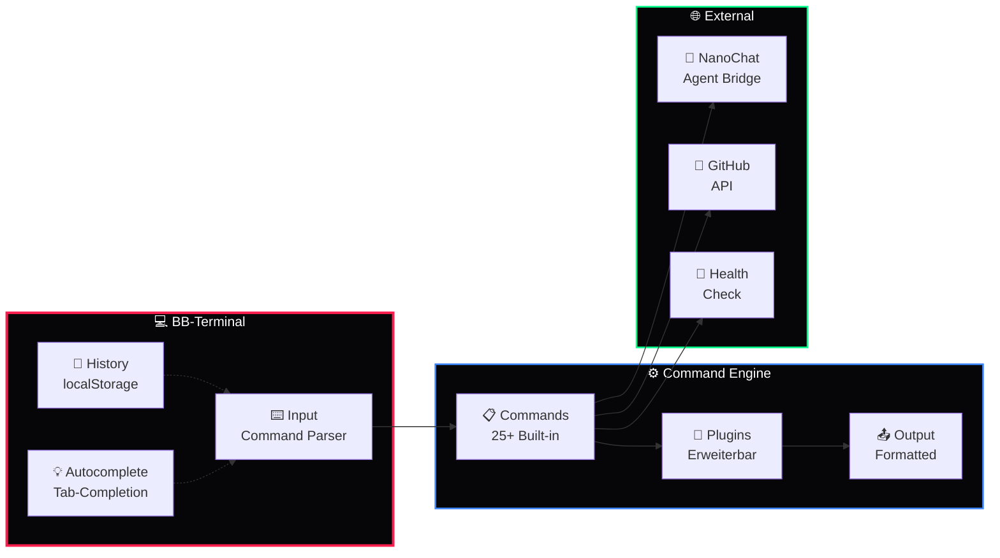

# 💻 BB-Terminal

### Browser-Based Terminal · WebShell · DkZ CLI · Agent Interface

*Vollständiges Terminal-Interface im Browser — Dark Neon Theme, Command History, Scriptable, Agent-Kommunikation*

---

---

## 📖 Überblick

**BB-Terminal** ist ein voll funktionsfähiges Browser-Terminal mit DEVKiTZ™ Branding. Dunkles Neon-Theme, Command History, Auto-Completion, Keyboard Shortcuts und direkte Agent-Kommunikation über die NanoChat Bridge.

> **Verwendung:** Quick-Access zu DkZ-Commands, Debugging, System-Status, Agent-Kommunikation und Health Checks — alles direkt im Browser.

---

## 🏛️ Architektur

---

## ⌨️ Commands

### System

| Command | Beschreibung | Beispiel |
|:--------|:-------------|:--------|
| `:help` | Alle Commands auflisten | `:help` |
| `:status` | System-Status anzeigen | `:status` |
| `:health` | Health-Check ausführen | `:health` |
| `:clear` | Terminal leeren | `:clear` / `Ctrl+L` |
| `:version` | Version + Build Info | `:version` |

### Module

| Command | Beschreibung | Beispiel |
|:--------|:-------------|:--------|
| `:modules` | Alle 132+ Module auflisten | `:modules` |
| `:open [name]` | Modul im Browser öffnen | `:open vibe-gallery` |
| `:search [query]` | Module durchsuchen | `:search blog` |
| `:features` | features.json anzeigen | `:features` |

### Agents

| Command | Beschreibung | Beispiel |
|:--------|:-------------|:--------|
| `:agents` | Agent Fleet Status | `:agents` |
| `:msg [agent] [text]` | Nachricht an Agent | `:msg antigravity status` |
| `:rednote` | Letzte Fehler anzeigen | `:rednote` |
| `:logs [n]` | Letzte n Log-Einträge | `:logs 20` |

### Git

| Command | Beschreibung | Beispiel |
|:--------|:-------------|:--------|
| `:git status` | Git Status | `:git status` |
| `:git log [n]` | Letzte n Commits | `:git log 5` |
| `:projects` | GitHub Projects auflisten | `:projects` |

---

## ⌨️ Shortcuts

| Tastenkürzel | Aktion |
|:-------------|:-------|
| `↑` / `↓` | Command History navigieren |
| `Tab` | Auto-Completion |
| `Ctrl+L` | Terminal leeren |
| `Ctrl+C` | Aktuellen Befehl abbrechen |
| `Escape` | Input leeren |

---

## 🔗 Ökosystem-Links

| Resource | Link |
|:---------|:-----|
| 🏠 **Dashboard** | [D-VKITZ.github.io](https://github.com/D-VKITZ/D-VKITZ.github.io) |
| 🤖 **BMAD™** | [bmad-framework](https://github.com/D-VKITZ/bmad-framework) |
| 🤖 **Agent Swarm™** | [agent-swarm](https://github.com/D-VKITZ/agent-swarm) |
| ⚙️ **KERN** | [KERN](https://github.com/D-VKITZ/KERN) |

---

*Teil des [DEVKiTZ™](https://github.com/D-VKITZ) Ökosystems · Made with ❤️ by 777*

